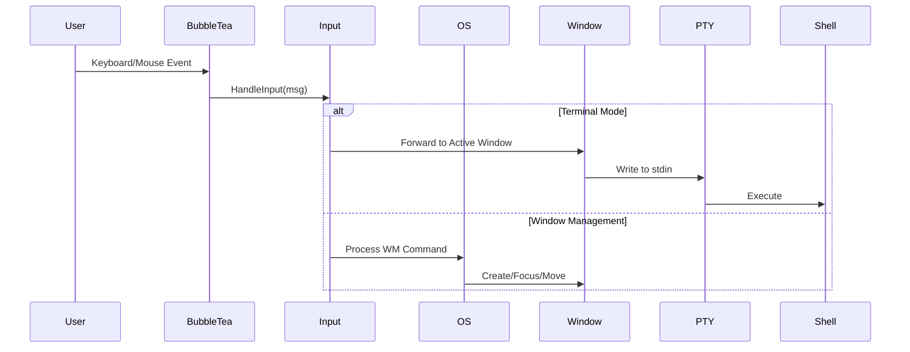
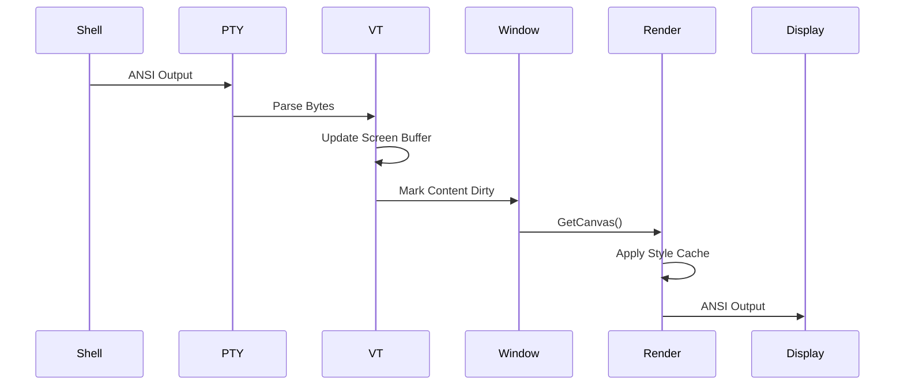

## Overview

TUIOS is built on the **Model-View-Update (MVU)** pattern using [Bubble Tea v2](https://charm.land/bubbletea), providing a clean separation between state, rendering, and event handling. The architecture follows a layered design with distinct responsibilities for window management, terminal emulation, and rendering.

## MVU Pattern

The core application follows Bubble Tea's Model-View-Update pattern:

### Model

The `OS` struct in `internal/app/os.go` represents the entire application state:

```go
type OS struct {
    Windows            []*terminal.Window  // All terminal windows
    FocusedWindow      int                 // Currently focused window index
    Mode               Mode                // WindowManagementMode or TerminalMode
    CurrentWorkspace   int                 // Active workspace (1-9)
    AutoTiling         bool                // Tiling mode enabled
    // ... 50+ more fields
}
```

Key state components:
- **Windows**: Collection of terminal window instances
- **Workspaces**: 9 independent virtual desktops
- **Mode**: Modal interaction (Window Management vs Terminal)
- **Animations**: Active window animations
- **Notifications**: Temporary UI messages

### View

`OS.View()` in `internal/app/render.go` generates the visual output:

```go
func (m *OS) View() tea.View {
    // 1. Cull off-screen windows
    // 2. Render visible windows from cache or VT buffer
    // 3. Apply styles from LRU cache
    // 4. Compose layers by Z-index
    // 5. Add overlays (dock, status, notifications)
    // 6. Return ANSI output
}
```

See `internal/app/render.go:146-186` for the full implementation.

### Update

`OS.Update()` in `internal/app/update.go` handles all events:

```go
func (m *OS) Update(msg tea.Msg) (tea.Model, tea.Cmd) {
    switch msg := msg.(type) {
    case tea.KeyPressMsg:
        return input.HandleKeyPress(msg, m)
    case tea.MouseClickMsg:
        return input.HandleMouseClick(msg, m)
    case TickerMsg:
        // Update animations, check for window changes
    }
}
```

See `internal/app/update.go:1-100` for event routing logic.

## Directory Structure

```
internal/
├── app/                # Core window manager and rendering
│   ├── os.go           # Central state (OS struct)
│   ├── render.go       # View generation and layer composition
│   ├── update.go       # Event handling (Update loop)
│   ├── stylecache.go   # LRU style cache (40-60% faster)
│   ├── workspace.go    # Workspace management (1-9)
│   └── animations.go   # Window animations
├── terminal/           # Terminal window management
│   ├── window.go       # Window struct and PTY lifecycle
│   └── pty_*.go        # Platform-specific PTY handling
├── vt/                 # Terminal emulation (ANSI/VT100)
│   ├── emulator.go     # Parser state machine
│   ├── screen.go       # Screen buffer management
│   ├── csi_*.go        # CSI sequence handlers
│   └── scrollback.go   # 10,000 line history
├── input/              # Input handling and modal routing
│   ├── handler.go      # Main input coordinator
│   ├── keyboard.go     # Key event dispatch
│   ├── mouse.go        # Mouse interactions
│   └── actions.go      # 40+ action handlers
├── config/             # Configuration system
│   ├── userconfig.go   # TOML config loading
│   └── registry.go     # Keybind action registry
├── layout/             # Window tiling algorithms
│   ├── bsp.go          # Binary space partitioning
│   └── tiling.go       # Grid calculations
├── pool/               # Memory pooling
│   └── pool.go         # Object reuse (strings, layers)
└── theme/              # Color theming
    └── theme.go        # ANSI palette management
```

## Key Technologies

### Bubble Tea v2

**MVU framework for terminal UIs**

- Event-driven architecture
- Declarative view rendering
- Built-in mouse and keyboard support
- Alt-screen and focus reporting

Import path: `charm.land/bubbletea/v2`

### Lipgloss v2

**Styling and layout**

- Style composition and caching
- Border rendering
- Color management (ANSI, RGB, truecolor)
- Canvas-based layer composition

Import path: `charm.land/lipgloss/v2`

### Wish v2

**SSH server framework**

- Per-session isolation
- Middleware-based architecture
- Built on Bubble Tea
- Automatic PTY allocation

Import path: `charm.land/wish/v2`

See `internal/server/ssh.go` for SSH implementation.

### go-pty (xpty)

**Cross-platform PTY support**

- Unix: `/dev/ptmx` with termios
- Windows: ConPTY API
- Automatic shell detection
- Window size (SIGWINCH) handling

See `internal/terminal/pty_unix.go` and `pty_windows.go`.

### Ultraviolet

**Terminal emulation base**

- VT100/ANSI parser
- Screen buffer management
- CSI sequence handling
- Scrollback support

Import path: `github.com/charmbracelet/ultraviolet`

## Data Flow

### Input Flow



**Terminal Mode**: Events forwarded directly to the focused window's PTY.

**Window Management Mode**: Events trigger window operations (create, close, focus, snap, resize).

See `internal/input/handler.go:19-83` for routing logic.

### Output Flow



**Polling goroutines** continuously read from PTY and feed bytes to the VT emulator.

See `internal/terminal/window.go` and `internal/vt/emulator.go`.

### Rendering Pipeline

1. **Viewport Culling**: Skip off-screen windows (`internal/app/render.go:57-64`)
2. **Cache Check**: Reuse cached layers if content unchanged (`render.go:83-86`)
3. **Content Rendering**: Build cell content from VT buffer (`render.go:99`)
4. **Style Application**: Apply cached Lipgloss styles (`internal/app/stylecache.go:120-153`)
5. **Layer Composition**: Stack by Z-index with Lipgloss compositor (`render.go:142`)
6. **Overlay Addition**: Dock, status bar, notifications (`render.go:133-140`)

## Modal System

TUIOS uses **two primary modes** for input handling:

### Window Management Mode

**Default mode** for window manipulation:

- Create/close windows
- Focus navigation
- Drag and resize with mouse
- Workspace switching
- Tiling commands

Prefix key (`Ctrl+B` by default) activates sub-modes:
- `Ctrl+B, w`: Workspace prefix
- `Ctrl+B, m`: Minimize prefix
- `Ctrl+B, t`: Tiling prefix

See `internal/input/keyboard.go` for keybinding implementation.

### Terminal Mode

**Activated when a window is focused** (press `i` or click window content):

- All input forwarded to focused window's PTY
- `Ctrl+B` prefix still accessible for TUIOS commands
- Mouse events passed through to terminal (if app supports mouse mode)

Press `Esc` to return to Window Management Mode.

## Thread Safety

Bubble Tea provides a **single-threaded event loop**, but TUIOS has concurrent components:

### PTY Polling Goroutines

**Per-window goroutines** read from PTY and update VT emulator:

```go
go func() {
    buf := make([]byte, 4096)
    for {
        n, err := pty.Read(buf)
        if err != nil { break }
        vt.Write(buf[:n])  // Thread-safe write
    }
}()
```

See `internal/terminal/window.go` for PTY lifecycle.

### Channel-Based Communication

For daemon mode, **channels** pass messages to the event loop:

- `StateSyncChan`: State updates from other clients
- `ClientEventChan`: Client join/leave events
- `WindowExitChan`: PTY exit signals

See `internal/app/os.go:114-115` for channel definitions.

## Related Documentation

- [Components](components) - Core component details
- [Performance](performance) - Optimization techniques
- [Configuration](/configuration/overview) - Customization options
