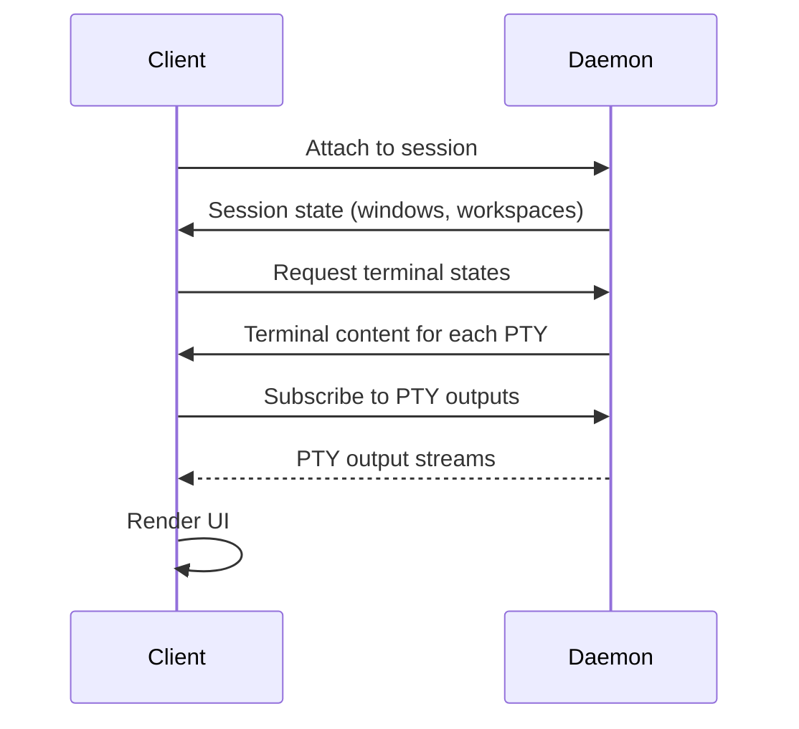

## Overview

TUIOS daemon mode enables **persistent sessions** that survive terminal disconnection. The daemon manages PTYs (pseudo-terminals) and stores session state, while clients attach/detach to view and interact with sessions.

### Architecture

```
┌─────────────────────────────────────────────┐
│  TUIOS Daemon (Background Process)          │
│  ├─ Session Manager                         │
│  ├─ PTY Management (persistent terminals)   │
│  ├─ State Storage (windows, workspaces)     │
│  └─ Unix Socket Server                      │
└─────────────────────────────────────────────┘
           ▲                   ▲
           │                   │
     ┌─────┴─────┐       ┌─────┴─────┐
     │  Client 1 │       │  Client 2 │
     │  (TUI)    │       │  (TUI)    │
     └───────────┘       └───────────┘
```

**Key Benefits:**
- Sessions persist when you disconnect
- Multiple clients can attach to the same session
- Remote control via CLI commands
- Session state survives crashes

<Info>
The daemon starts automatically when you create or attach to a session. You rarely need to manage it manually.
</Info>

---

## Session Lifecycle

### Creating a New Session

Create a named session:

```bash
tuios new mysession
```

Create a session with auto-generated name:

```bash
tuios new
# Creates: session-0, session-1, etc.
```

<CodeGroup>
```bash Terminal Output
$ tuios new dev
Starting TUIOS daemon...
Creating session 'dev'
[detached from session 'dev']
```
</CodeGroup>

The daemon starts in the background (if not already running) and you're immediately attached to the new session.

### Attaching to an Existing Session

Attach to a named session:

```bash
tuios attach mysession
```

Attach to the most recent session:

```bash
tuios attach
```

Create if missing (like tmux's `new-session -A`):

```bash
tuios attach mysession -c
```

<Tip>
Use `tuios attach` with no arguments to quickly reconnect to your last session.
</Tip>

### Detaching from a Session

While inside TUIOS, press the detach key:

```
Ctrl+B d     # Detach from session
```

The session continues running in the daemon. All windows and their processes remain active.

### Listing Sessions

View all active sessions:

```bash
tuios ls
```

<CodeGroup>
```bash Example Output
$ tuios ls
╭─────────────┬─────────┬──────────┬────────────────────╮
│ Name        │ Windows │ Attached │ Created            │
├─────────────┼─────────┼──────────┼────────────────────┤
│ dev         │ 3       │ no       │ 2h ago             │
│ prod        │ 5       │ yes      │ 1d ago             │
│ session-0   │ 1       │ no       │ 3h ago             │
╰─────────────┴─────────┴──────────┴────────────────────╯
```
</CodeGroup>

Alias: `tuios list-sessions`

### Killing a Session

Terminate a session and all its windows:

```bash
tuios kill-session mysession
```

<Warning>
This closes all windows and terminates all processes in the session. Use with caution.
</Warning>

---

## Daemon Management

### Starting the Daemon

The daemon starts automatically, but you can start it manually:

```bash
tuios start-server
```

<Note>
This command is hidden because users rarely need it. Sessions automatically start the daemon.
</Note>

### Running in Foreground (Debugging)

Run the daemon in the foreground with debug logging:

```bash
tuios daemon
```

With detailed message logging:

```bash
tuios daemon --log-level=messages
```

**Debug Levels:**
- `off` - No debug output (default)
- `errors` - Only error messages  
- `basic` - Connection events and errors
- `messages` - All protocol messages except PTY I/O
- `verbose` - All messages including PTY I/O
- `trace` - Full payload hex dumps

<CodeGroup>
```bash Example Debug Output
$ tuios daemon --log-level=basic
TUIOS daemon started on /run/user/1000/tuios.sock (PID 12345)
Client client-1234 connected
Client client-1234 attached to session dev (TUI client, 1 clients total)
```
</CodeGroup>

### Stopping the Daemon

Shutdown the daemon (terminates all sessions):

```bash
tuios kill-server
```

This:
1. Disconnects all clients
2. Closes all PTYs
3. Removes the Unix socket
4. Exits the daemon process

<Warning>
All running sessions will be terminated. Attach to sessions and exit cleanly if you want to preserve shell history.
</Warning>

### Viewing Daemon Logs

View recent daemon activity:

```bash
tuios logs
```

View more entries:

```bash
tuios logs -n 100
```

Follow logs in real-time:

```bash
tuios logs -f
```

Clear logs after viewing:

```bash
tuios logs --clear
```

<CodeGroup>
```bash Example
$ tuios logs -n 20
[14:23:45.123] [INFO] Client client-abc attached to session dev
[14:23:46.456] [DEBUG] PTY abc123 created
[14:24:10.789] [INFO] Session dev resized to 120x40

--- 20 log entries ---
```
</CodeGroup>

---

## State Persistence

### What Gets Persisted

The daemon stores:

**Window State:**
- Window position, size, z-order
- Workspace assignment
- Custom window names
- Minimized state
- Terminal content (scrollback + screen)

**Session State:**  
- Current workspace (1-9)
- Focused window per workspace
- Tiling mode enabled/disabled
- Master ratio for tiling
- BSP tree structure

**PTY State:**
- Running shell processes
- Terminal screen buffer
- Scrollback history (10,000 lines)
- Cursor position
- Terminal modes (mouse tracking, etc.)

<Info>
Terminal content is fully preserved across disconnects. When you reattach, you'll see exactly what was on screen, including all colors and formatting.
</Info>

### Reconnection Flow

When you attach to an existing session:

1. **Daemon sends session state** - Window positions, workspace, tiling mode
2. **Client restores windows** - Creates window objects from state
3. **Daemon sends terminal states** - Screen content, scrollback, cursor position  
4. **Client syncs PTY handlers** - Connects to daemon's PTY output streams
5. **Client redraws UI** - Renders everything exactly as it was



---

## Multi-Client Sessions

Multiple clients can attach to the same session simultaneously.

### Behavior

- **Shared state** - All clients see the same windows, workspace, focus
- **Synchronized input** - Changes from one client appear on all clients
- **Size adaptation** - Session size = minimum of all client sizes
- **Independent detach** - Clients can attach/detach independently

### Size Handling

When multiple clients connect:

```
Client A: 200x50
Client B: 120x30  ← smallest
Client C: 160x40

Session size: 120x30 (minimum)
```

All clients render at 120x30. Clients with larger terminals see empty space.

<Tip>
For best experience, use similar terminal sizes across clients, or resize your terminal to match the session size shown in `tuios ls`.
</Tip>

### Example Workflow

**Terminal 1:**
```bash
tuios new shared
# Work with 3 windows
```

**Terminal 2 (simultaneously):**  
```bash
tuios attach shared
# See the same 3 windows, all changes sync
```

**Terminal 3 (later):**
```bash
tuios attach shared
# Session resizes to minimum of all 3 clients
```

---

## Socket and PID Files

### Socket Location

**Linux/macOS:**
```
/run/user/$UID/tuios.sock
```

**Windows:**  
```
%LOCALAPPDATA%\tuios\tuios.sock
```

### PID File

**Linux/macOS:**
```
/run/user/$UID/tuios.pid
```

**Windows:**
```
%LOCALAPPDATA%\tuios\tuios.pid
```

The PID file is removed on clean shutdown.

---

## Troubleshooting

### Daemon Won't Start

**Check for stale socket:**
```bash
rm /run/user/$(id -u)/tuios.sock
tuios new
```

**Check permissions:**
```bash
ls -la /run/user/$(id -u)/
# Socket should be owned by you with 0700 permissions
```

### Can't Attach to Session

**List sessions:**
```bash
tuios ls
# Verify session exists
```

**Check daemon logs:**
```bash
tuios logs
```

**Restart daemon:**
```bash
tuios kill-server
tuios new
```

### Session State Corrupted

**Kill and recreate:**
```bash
tuios kill-session mysession
tuios new mysession
```

<Warning>
This loses all windows and history in that session.
</Warning>

---

## Advanced Usage

### Scripting with Sessions

Create and populate a session via CLI:

```bash
#!/bin/bash
tuios new dev
sleep 1

tuios run-command --session dev NewWindow "Server"
tuios send-keys --session dev --literal "npm run dev" 
tuios send-keys --session dev Enter

tuios run-command --session dev NewWindow "Editor"
tuios send-keys --session dev --literal "nvim" 
tuios send-keys --session dev Enter

echo "Session 'dev' created with 2 windows"
```

### Integration with tmux

TUIOS complements tmux:

```bash
# Use tmux for terminal multiplexing
# Use TUIOS for visual window management

tmux new-session -d -s build
tmux send-keys "tuios new build-ui" C-m
```

### SSH Server Integration

Run TUIOS daemon sessions over SSH:

```bash
# On server
tuios ssh --port 2222

# From client  
ssh -p 2222 user@server
# Automatically attaches to TUIOS session
```

See [SSH Server](/advanced/ssh-server) for details.

---

## Comparison: Daemon Mode vs. Local Mode

| Feature | Daemon Mode | Local Mode |
|---------|-------------|------------|
| Persistence | ✅ Sessions survive disconnect | ❌ Exits when closed |
| Multi-client | ✅ Multiple attachments | ❌ Single instance |
| Remote control | ✅ CLI commands | ❌ Not available |
| State recovery | ✅ Full state + terminal content | ❌ Lost on exit |
| Complexity | Daemon + socket | Single process |
| Use case | Persistent workflows | Quick sessions |

<Tip>
Use daemon mode (default) for all regular work. Use local mode (`tuios` without session commands) only for quick tests.
</Tip>

---

## See Also

<CardGroup cols={2}>
  <Card title="Remote Control" icon="terminal" href="/guides/remote-control">
    Send commands to running sessions
  </Card>
  <Card title="SSH Server" icon="network-wired" href="/guides/ssh-server">
    Run TUIOS over SSH  
  </Card>
  <Card title="Multi-Client" icon="users" href="/advanced/multi-client">
    Advanced multi-client patterns
  </Card>
  <Card title="Configuration" icon="gear" href="/configuration">
    Daemon and session settings
  </Card>
</CardGroup>
